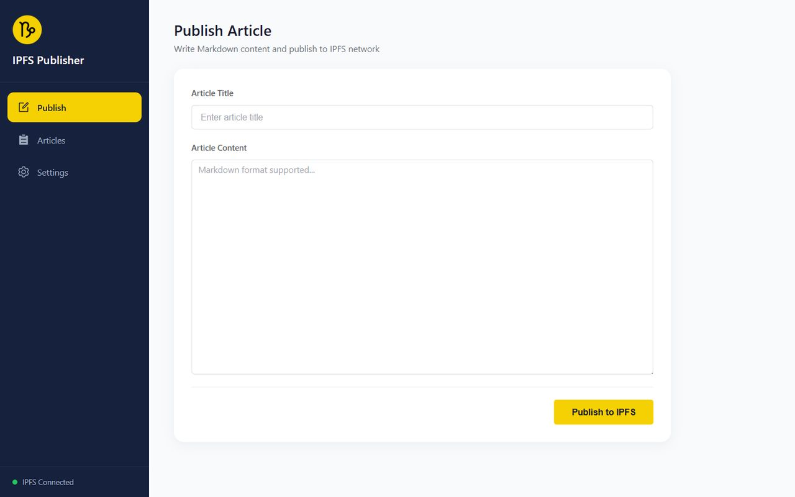

# IPFS Publisher

[中文文档](./README.zh-CN.md) / [English document](./README.md)

A simple browser extension to publish Markdown articles to IPFS network.



Currently under review in the store, please download beta version from releases.

## Features

- Write Markdown content and publish to IPFS with one click
- Automatically convert to styled HTML pages
- Manage published article list
- Custom IPFS gateway and local node API address support
- Real-time Markdown preview
- Multi-language support (Chinese/English), follows browser language by default

### Roadmap

- [ ] Create keys using IPNS, bind to unique URL

## Usage

1. Install [IPFS Desktop](https://docs.ipfs.tech/install/ipfs-desktop/)
2. Load the extension
3. Write and publish articles in the popup or options page

## Development

```bash
# Install dependencies
npm install

# Start development server
npm run dev

# Build for production
npm run build

# Package for release
npm run zip
```

## Tech Stack

- Vue 3 + TypeScript
- Element Plus
- WXT (Browser Extension Framework)
- vue-i18n (Internationalization)

## License

[Apache-2.0 license](./LICENSE)
