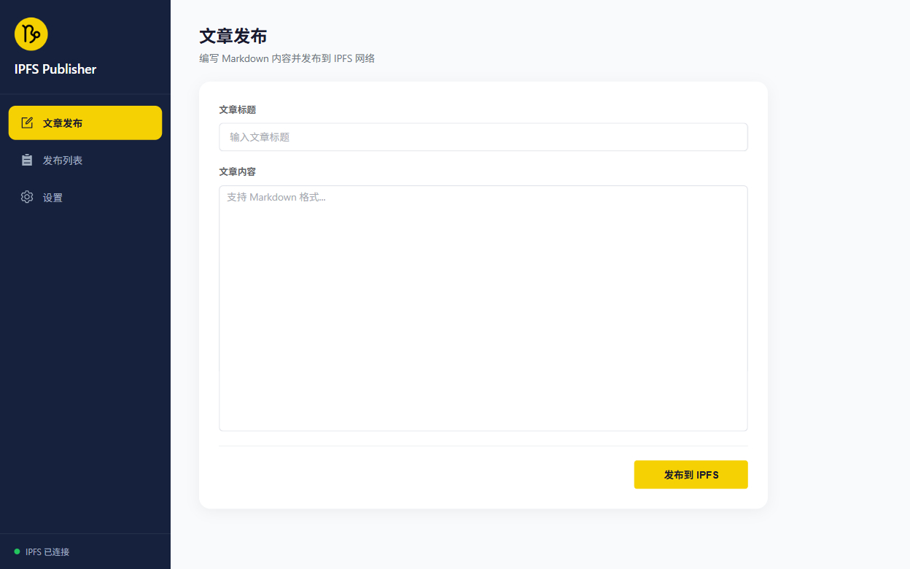

# IPFS Publisher

[中文文档](./README.zh-CN.md) / [English document](./README.md)

一个简单的浏览器扩展，用于将 Markdown 文章发布到 IPFS 网络。



商店目前在审核中，beta 版请下载 releases。

## 功能

- 编写 Markdown 内容并一键发布到 IPFS
- 自动转换为带样式的 HTML 页面
- 管理已发布的文章列表
- 支持自定义 IPFS 网关和本地节点 API 地址
- Markdown 实时预览
- 多语言支持（中文/English），默认跟随浏览器语言

### 开发计划

- [ ] 使用 IPNS 创建密钥，绑定唯一 URL

## 使用方法

1. 安装 [IPFS Desktop](https://docs.ipfs.tech/install/ipfs-desktop/)
2. 加载扩展
3. 在弹窗或后台页编写文章并发布

## 开发

```bash
# 安装依赖
npm install

# 启动开发服务器
npm run dev

# 构建生产版本
npm run build

# 打包发布
npm run zip
```

## 技术栈

- Vue 3 + TypeScript
- Element Plus
- WXT (浏览器扩展框架)
- vue-i18n (国际化多语言)

## 许可证

[Apache-2.0 license](./LICENSE)
